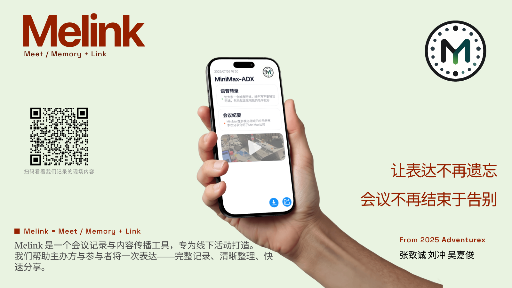

# MeLink - AdventureX 2025 Hackathon Project

欢迎来到 MeLink！

MeLink 是一款记录会议内容并识别发言人，帮助用户会后迅速获得视频、语音、总结，并建立彼此真实连接的知识社交工具。



## 🙋 为什么做这个？

在ADX活动中，团队小伙伴们密集参与了多场线下对话与讲座。

频繁深入的交流碰撞，让大家不断迸发出各种有趣的想法和灵感。

然而，我们发现市面上缺少一款能够简单录制内容，并且**以最简单方式进行分享**的工具。

于是，我们用不到一天的时间打造了这款应用。**Just Do It！**


## ✨ 功能特性

- **会议**: 会议视频与总结信息的展示
- **分享**: 为每个上传的文件生成一个独特的、可分享的链接。
- **页面**: 每个分享链接都有一个专属的展示和下载页面。
- **二维码**: 自动为分享链接生成二维码，方便移动设备访问。
- **数据管理**: 使用 Vercel KV 存储和管理文件元数据。
- **响应式设计**: 使用 Tailwind CSS 构建，在桌面和移动设备上都有出色的体验。

## 🛠️ 技术栈

- **框架**: [Next.js](https://nextjs.org/)
- **语言**: [TypeScript](https://www.typescriptlang.org/)
- **UI**: [React](https://react.dev/) & [Tailwind CSS](https://tailwindcss.com/)
- **存储**: [Vercel Blob](https://vercel.com/storage/blob) (文件) & [Vercel KV](https://vercel.com/storage/kv) (元数据)
- **部署**: [Vercel](https://vercel.com/)

## 🚀 本地开发指南

请按照以下步骤在您的本地环境中设置和运行项目。

### 1. 克隆仓库

```bash
git clone <your-repository-url>
cd melink
```

### 2. 安装依赖

我们使用 `npm` 作为包管理器。

```bash
npm install
```

### 3. 配置环境变量

项目需要连接到 Vercel 的云服务。您需要配置一些环境变量。

1.  在 `melink` 目录下，创建一个名为 `.env.local` 的文件。
2.  详细的配置步骤和如何获取 API 密钥，请参考 **[环境变量配置指南.md](./环境变量配置指南.md)**。

您的 `.env.local` 文件内容应如下所示：

```env
# Vercel Blob 存储配置
BLOB_READ_WRITE_TOKEN=vercel_blob_rw_xxxxxxxxxxxxx

# Vercel KV 数据库配置
KV_REST_API_URL=https://xxxxxxxx.kv.vercel-storage.com
KV_REST_API_TOKEN=xxxxxxxxxxxxxxxxxxxxxxxxxxxxxx

# Next.js 应用配置
NEXT_PUBLIC_VERCEL_URL=localhost:3000
```

### 4. 启动开发服务器

一切准备就绪后，运行以下命令来启动本地开发服务器：

```bash
npm run dev
```

现在，您可以在浏览器中打开 [http://localhost:3000](http://localhost:3000) 来访问应用了。

## 📜 可用脚本

- `npm run dev`: 启动开发模式服务器。
- `npm run build`: 为生产环境构建应用。
- `npm run start`: 启动生产模式服务器 (需要先运行 `build`)。
- `npm run lint`: 运行 ESLint 来检查代码规范。

## 部署

本项目已为 [Vercel](https://vercel.com/) 部署进行了优化。只需将您的仓库连接到 Vercel，并按照 `环境变量配置指南.md` 在 Vercel 项目设置中配置相同的环境变量即可。